# 纳西妲的旅行

旅行放置玩法的非商业同人。零依赖单页网页：**双击 `开始游戏.html` 就能玩** —— 不需要安装任何东西、不需要联网、不需要 API Key。
实际上这个玩法搭起来，主角并不限于纳西妲，可以换成你喜欢的任意角色，地点也不局限于国内，甚至换成提瓦特，或者任意地图都行。而这些只需要随便一个ai助手换个素材的事情。
不用下载，点开即玩：https://jessicaIsleep.github.io/Genshin-Impact-travel/
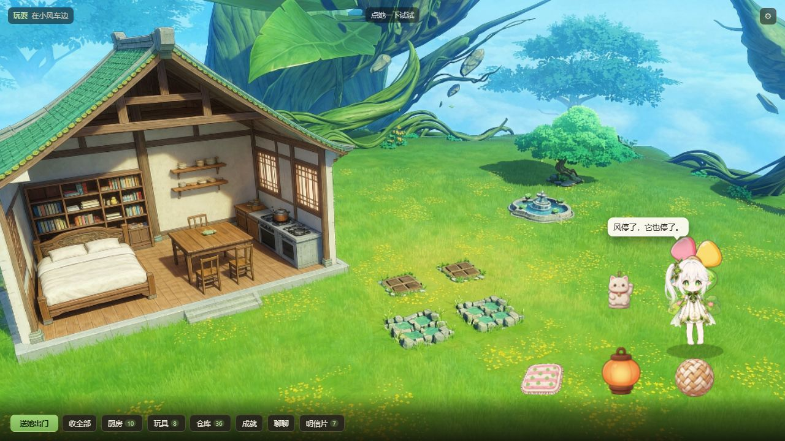

> 非商业同人作品。角色来自《原神》（米哈游），版权归原厂所有。
> 本项目仅供学习交流，不作任何商业用途。

---

## 怎么运行

| 想做什么 | 怎么做 |
|---|---|
| 玩游戏 | 双击 `开始游戏.html`（或 `index.html`，它会跳转过去） |
| **一次看到所有界面**（灌了示范数据） | `开始游戏.html?demo=1` |
| 直接跳到某一屏 | `开始游戏.html?demo=1&modal=kitchen`（kitchen/toys/chat/album/settings/outdoor/result/waiting） |
| 看点击反应的气泡 | `开始游戏.html?demo=1&poke=1` |
| 跑自检 | `开始游戏.html?selftest=1` |
| 看明信片效果预览 | 双击 `tools/preview.html`（可加 `?n=12&scale=0.3`） |
| 导出装饰素材 | 双击 `tools/asset-generator.html` |

### 界面预览

| | |
|---|---|
| 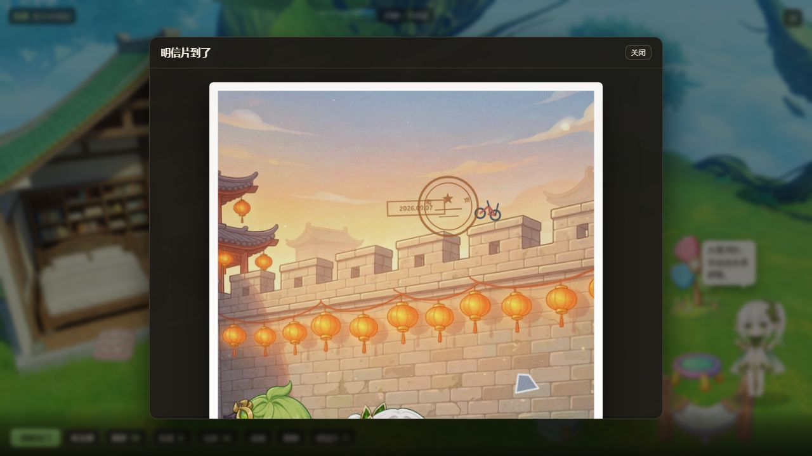 | 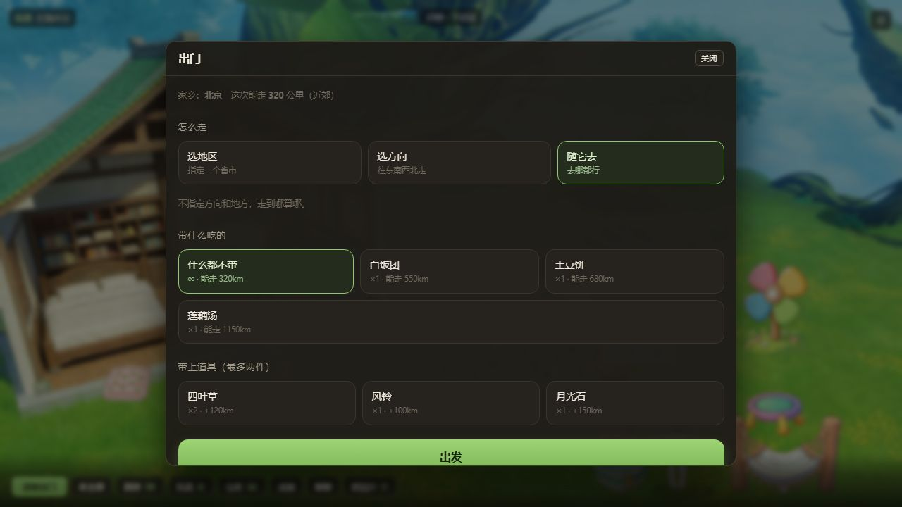 |
| 明信片（12 层合成，全部代码绘制） | 送她出门：选方向 / 带料理 / 带道具 |
| 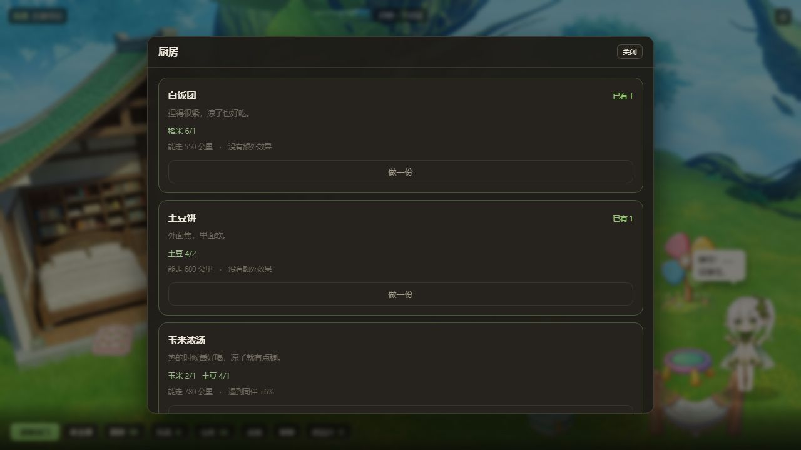 | 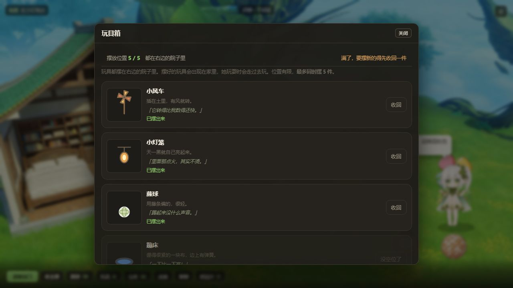 |
| 厨房 | 玩具箱（显示摆放上限） |
| 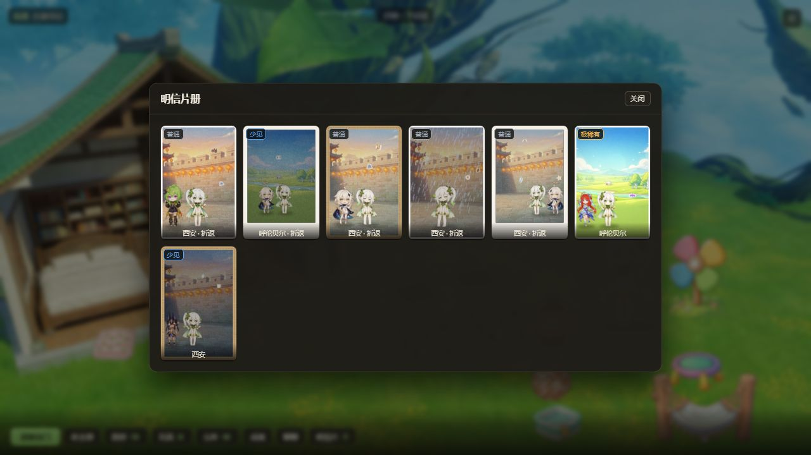 | 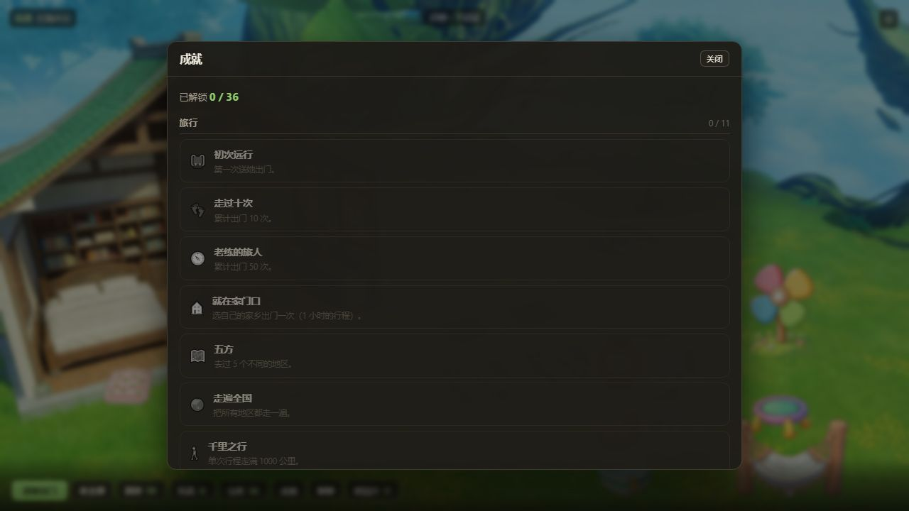 |
| 明信片册 | 成就（36 个） |
| 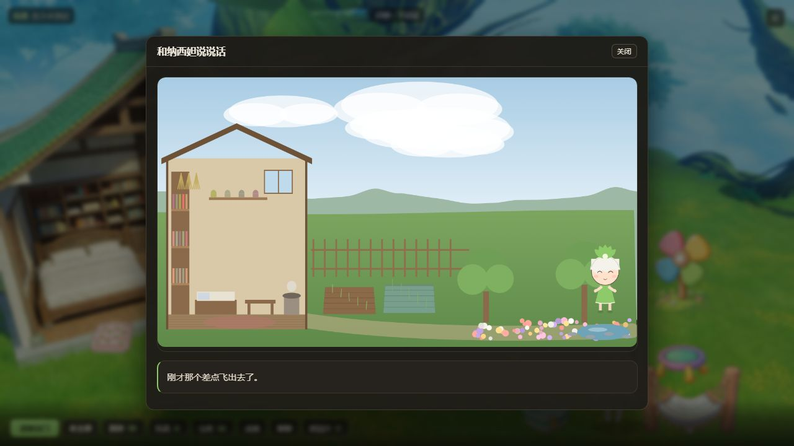 | 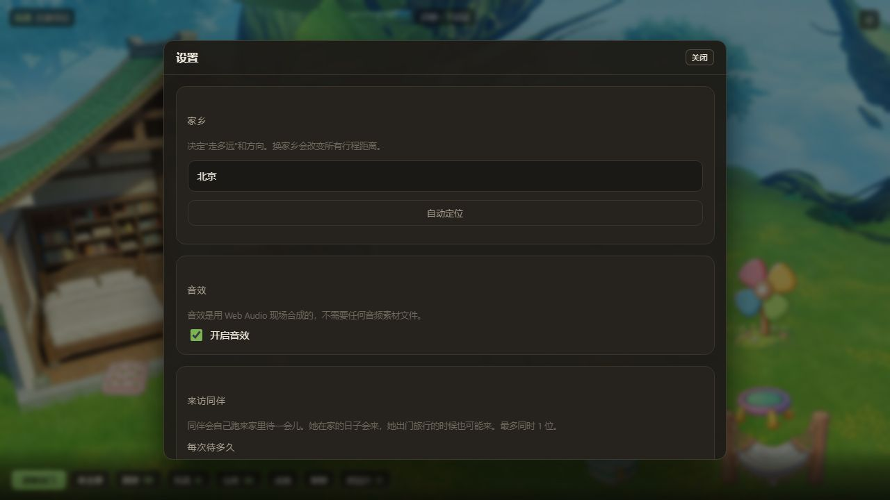 |
| 和她聊天（可接 DeepSeek 变 AI 角色扮演） | 设置（家乡 / 音效 / 同伴 / 素材状态） |
| 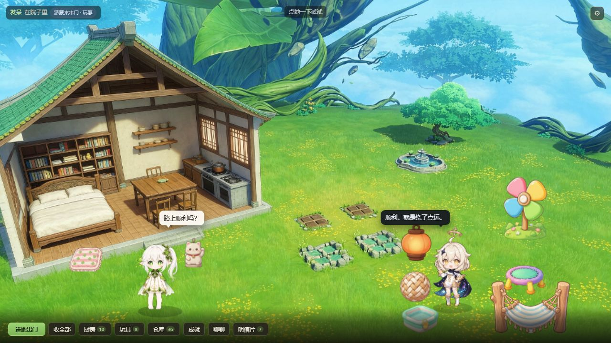 | 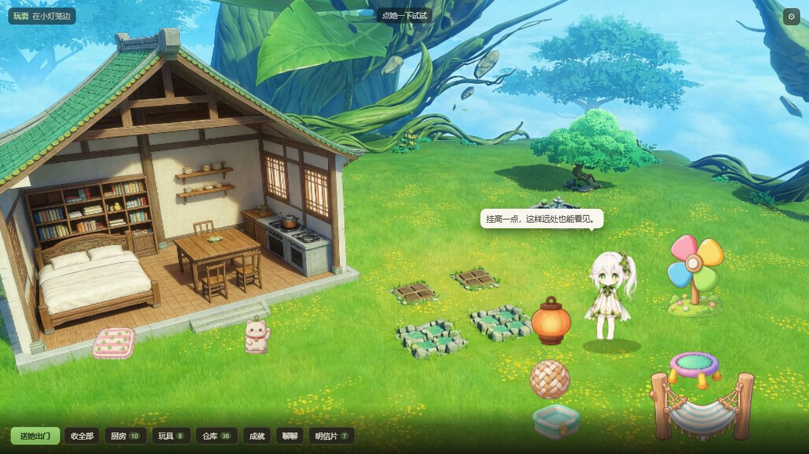 |
| 同伴来串门：她在左边发呆，客人在右边玩 | 她去玩玩具了，客人就回屋里待着 |
| 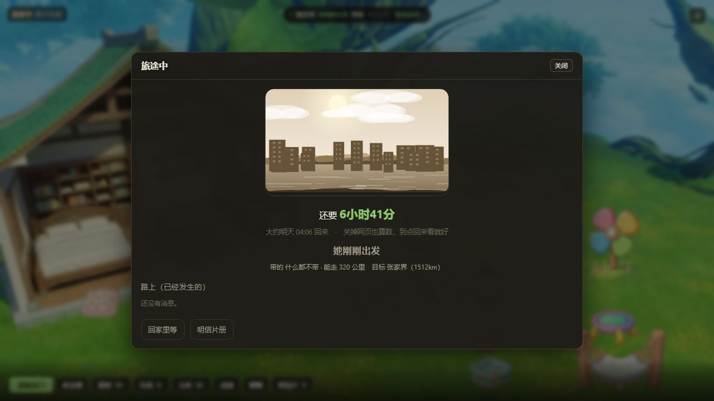 | 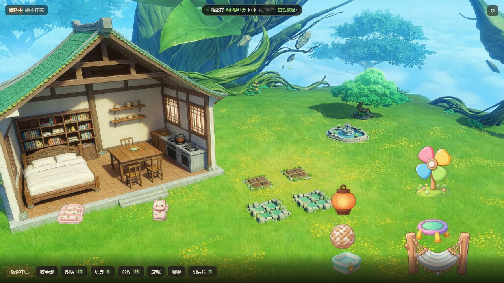 |
| 旅途中：写明还要多久、几点回来，随时可以关掉 | 关掉后顶部常驻倒计时，点一下能打开详情 |


**不需要** Node、npm、Python、构建、服务器。用 Edge / Chrome 打开即可。

---

## 家：一个真·全屏的 16:9 世界

家不是一个菜单，是**一整块占满窗口的 16:9 画面**，会随窗口大小自动缩放（宽窗口时上下撑满、左右留黑边，窄窗口/竖屏时自动改成"舞台在上、控件在下"）。

```
┌────────────────┬──────────────────┬──────────────────┐
│  半截面屋子      │   院子            │   花园            │
│  书架/床/桌/灶台 │  两块田直接画在    │  树/花丛/池塘      │
│  墙上有搁板      │  画面里，点一下    │  玩具摆在这里      │
│  （切开一半，能  │  就能种/收         │                  │
│   看见她在里面） │                   │                  │
└────────────────┴──────────────────┴──────────────────┘
        纳西妲在里面实时走动、做事
   ┌──────────────────────────────────────────────┐
   │        ╭──────────────╮                       │
   │        │ 它滚到田里去了。│  ← 她说话只从气泡出   │
   │        ╰───────┬──────╯                       │
   │  [送它出门] [收全部] [厨房 10] [玩具 8] [仓库 36] …│  ← 按钮也在画面里
   └──────────────────────────────────────────────┘
```

**控件全部在画面里**（底部悬浮栏），不是画面外面的一排卡片。按钮字号跟着舞台宽度缩放。

**所有页面都在画面里弹，不切屏。** 点厨房/玩具/仓库/聊聊/明信片/设置/出门，会在家的画面上浮出一个半透明面板（宽约 55–60%，最高 94%，内容多时内部滚动），背景虚化；点面板外或"关闭"就收起来。**她出门在外时，家里不画人**，等待面板自动接管。

**屋子做成半截面**，就是为了不用切换场景也能看见她在屋里做什么 —— 她在书架前看书、在灶台边做饭、在床上睡觉（会躺下），你全都看得见。

**两块田直接画在画面里**，不用按钮切换屏幕 —— 点一下就弹出种植面板。面板很小、浮在田的上方，**不会挡住人物**。

### 她的话只有一个出口：人物旁边的气泡

底部**不再有单独一行台词** —— 那样会和她旁边的气泡重复。现在所有台词都从气泡里出：

- **她换状态时**自动开口说一句（比如玩耍时说「它滚到田里去了。」），气泡 7 秒后消失
- **你点她时**换成和当前状态对应的反应台词，气泡 5 秒后消失
- 气泡跟着她的位置走，靠右站时自动翻到左侧，**尾巴也跟着换边**

顶部左侧的状态徽章（`玩耍 · 在草坪上`）仍然一直在，所以你不点她也能知道她在干嘛。

### 她会实时走动

**纳西妲有 9 种居家状态**，每 10–40 分钟换一次，状态决定她走到哪里：

| 状态 | 去哪 | 状态 | 去哪 |
|---|---|---|---|
| 发呆 | 院子中间 | 浇水 | 旱田/水田边（轮换） |
| 睡觉 | 床边（躺下） | 做饭 | 灶台边 |
| 吃饭 | 桌边 | 伸懒腰 | 门口 |
| 玩耍 | 草坪（会去玩摆出来的玩具） | 望着路口 | 篱笆门 |
| 看书 | 书架前 | | |

状态切换时她会**走过去**（不是瞬移），走路时有起伏，站着时有轻微呼吸感。

### 点她一下，她会有反应

点纳西妲（或者从别的地方切回来）会触发**和当前状态对应的反应**：

| 她在 | 反应 | 她会说 |
|---|---|---|
| 睡觉 | **翻个身** | 「（翻了个身，把脸埋进枕头）」 |
| 发呆 | 抬起头 | 「……嗯？」 |
| 吃饭 | 把碗推过来 | 「你要不要尝一口？」 |
| 玩耍 | **原地蹦一下** | 「一起！」 |
| 看书 | 从书上面看你一眼 | 「……等一下，这段看完。」 |
| 浇水 | 往旁边挪半步 | 「小心，别站太近。」 |
| 做饭 | 一边搅两下 | 「别急，还没好。」 |
| 伸懒腰 | 缩一下 | 「……别看我。」 |
| 望着路口 | 转过身来 | 「（转过身来）你回来了。」 |

反应有 1.8 秒冷却，动画作用在角色本体上（旋转/缩放/位移），台词走人物旁边的气泡。

---

## 旅途：食物决定能走多远

这是最核心的系统。一次出行不是"随机一个目的地"，而是**逐段推进的行程模拟**。

```
预算（km）= 料理的能量 + 带的稀有道具
目标花费（km）= 家乡到目标的球面距离 × 偏远系数

每走一段：消耗预算前进 280~620km，并触发一次事件
  ├ 补给  +640~1050km   → 能走更远
  ├ 挫折  -150~420km，或掉河里食物被冲走 → 直接回家（落汤鸡）
  ├ 改道  被同伴邀请 / 看到宣传画 / 前面封路 → 换了目的地（一次为限）
  ├ 遭遇  遇到同伴
  └ 风景  只是沿途见闻
```

预算走完还没到，就**半路折返** —— 会按走了多少比例插值出一个位置，找最近的地区作为明信片来源。

### 出门方式与真实地理

| 方式 | 说明 |
|---|---|
| **选地区** | 16+ 个中国省市，显示距家乡多少公里 |
| **选方向** | 按**相对家乡的实际方位**筛选（往北是真的往北，不是按标签） |
| **随它去** | 不指定 |

方向只是起点 —— 路上可能被同伴邀请、看到宣传画而**改道**。

### 距离与时间

| 地区 | 距北京 | 偏远系数 | 行程花费 |
|---|---|---|---|
| 西安 | 910km | 1.0 | 910 |
| 三亚 | 2440km | 1.2 | 2928 |
| **漠河** | 1525km | **2.1** | **3205** |

时间 = `1 小时 + 行程 / 95km`，**上限 48 小时，下限 1 小时**。
同城 = 1 小时。实测 **92% 的行程在 24 小时内**。

### "去漠河必须靠补给" 是被验证过的

最强配置（五谷丰登 1950 + 幸运币 250 + 古老种子 300）= **2500km 预算 < 3205km 路程**。

**光靠食物永远走不到漠河**，必须路上连续抽到补给事件。自检里有断言，实测带满配置到达率 26.7%，平均要吃 3.4 次补给。

`docs/s-result.png` 就是一张真实的例子：只带了 320km 的食物，靠「搭顺风车 +705km」和同伴补给走到西安，最后半路折返。

---

## 其他系统

**种植** —— 旱田（土豆/小麦/大豆/番茄/玉米）+ 水田（茭白/荸荠/水稻/菱角/莲藕），真实时间生长 2–8 小时，关页面照常长。收获得食材，并**有几率掉稀有道具**。

> 稀有道具只提高拿到稀有明信片的概率和行程预算，不直接产出明信片。

**厨房** —— 11 道料理，食材合成"出门带的食物"。每道菜标着能走多少公里。

**仓库** —— 食材 / 料理 / 稀有道具的总览。稀有道具那栏会写明**每一件的掉落率和效果**，以及"它们不影响明信片内容，只影响能走多远和稀有度"。（以前没有背包界面，收完东西就找不到了。）

**玩具** —— 旅行有几率带回（秋千/蹦床/风车/水池/灯笼/吊床/藤球/沙坑/地毯/挂饰），分**屋内/屋外**两类。她玩耍时会真的去玩摆出来的那个玩具，并说出对应台词。

**交流** —— 5 个话题 × 3 句预设回答 × 3 条随机回应。**接入 API 后升级成 AI 角色扮演**（见下）。

**成就** —— **36 条**，分 6 组：旅行 / 明信片 / 种植 / 同伴 / 家 / 特殊。达成时弹出提示 + 响一声。

> 旅行相关的统计（去过几个地方、最远走了多少、最远落脚点、落汤鸡次数……）**直接从图鉴推导** —— 事实卡里本来就记着所有细节，不需要额外维护一堆计数器。只有"发生过就没了"的（收获次数、种过哪些作物、拿到过哪些道具、聊天/戳她次数）才单独计数。

**来访同伴** —— 别的角色会自己跑来家里待一会儿，**她在家和出门时都可能来**。

- 最多同时 1 位，每个同伴出现概率相同；停留时长在设置里可调（5~40 分钟）
- 客人有自己的活动池（玩玩具 / 吃饭 / 看书 / 发呆）和一套**和主角不重样的文案**
- **核心约束：两人永远分在画面两侧** —— 主角在左侧做屋里的事，客人就在右侧玩玩具；主角去玩玩具，客人就回屋里。这样不会有图层叠加问题，也不需要处理两人的碰撞
- 主角在「发呆」时会触发一组**打招呼对话**（一来一回两条气泡）
- 同伴的侧别会在**主角每次换状态时强制重算** —— 否则会出现两人都在右侧（`nature` 自检钉住了这一点）

**音效** —— **14 种**，全部用 **Web Audio 现场合成**，**不需要任何音频素材文件**，也不占体积。包括点击、开合面板、播种、收获、稀有掉落、做饭、出门、明信片到家、成就达成、她说话、戳她、操作失败。

> AudioContext 必须在用户手势里创建，所以第一次点击时才初始化；浏览器不支持时静默降级，不影响游戏。

**出门后的等待** —— 面板写明**还要多久**和**大约几点回来**，而且**可以直接关掉**：
关掉后顶部常驻一条倒计时，点一下能打开详情。结算由 20 秒一次的定时器负责，
**不用刷新页面**（以前只在页面加载时结算一次，这是个真 bug）。

**同伴** —— 10 个原神角色。不是必然遇到，食物/道具/运气提高概率。

**定位（可选）** —— 首次启动可以选家乡（**52 个候选城市**，含所有目的地 + 34 个纯出发点城市），也可以点「自动定位」：先试浏览器定位，失败退到 IP 定位，都失败就让你手选。**绝不阻塞游戏**。

---

## 接入 API 后：AI 角色扮演聊天

设置里填上 Key 之后，聊天会从"预设对话"升级成 **AI 扮演纳西妲**：

- 发给模型的 system prompt 是她的**人设卡**：须弥草神、温和克制、说话简短、带一点学究气、不用感叹号堆情绪
- 附带**她现在的状况**做上下文：当前状态、所在位置、正在玩什么、家乡、带回来多少明信片、田里有没有熟的 —— 所以她能接上话
- 带上**最近的对话记录**，所以她记得刚才聊了什么
- 硬约束：只回 1~2 句、不超过 60 字、不提现实事物、不出现"AI/玩家/系统"、只输出台词本身

**降级**：AI 关了 / 没填 Key / 请求失败 / 回复不合规 → 自动回退到预设回应，绝不弹错。回复上会标 `AI` 小标签，让你知道这次是谁说的。

除了预设的 3 句回答，**还能自己打字**（有 AI 时才会出现输入框），回车发送。

**注意**：日记生成（明信片）和聊天用的是两套不同的提示词 —— 前者要求严格基于事实卡输出 JSON，后者允许自由发挥但要守人设。

---

## 两条设计红线

### 1. AI 绝不参与游戏逻辑，只做措辞渲染

规则引擎用种子随机算出全部事实 → 事实卡 → 模板渲染（保底）/ AI 重写（可选）/ Canvas 合成。

**不填 Key 也能完整通关。** AI 挂了、断网了也照样跑。同种子必然同结果。

**越界校验 `noNewFacts`**：AI 若编造了事实卡以外的地区名、角色名，或出现现实世界词汇，直接判废回退模板。

### 2. 存档里不存图片，事件内容内嵌

- 明信片从事实卡确定性重绘 → 100 张明信片存档也只有几 KB（自检有体积断言）
- **旅途事件的名字/描述/时间戳随事实卡一起存** → 后续改数据不会让旧明信片变样
- 等待期间可以**逐步揭晓**已经"发生"的旅途事件（每段带 `at` 时间戳）

---

## 目录结构

```
nahida-travel/
├─ 开始游戏.html                入口 —— 双击这个就能玩
├─ 说明.txt                    给玩家看的玩法说明
├─ LICENSE                     MIT（代码）+ 素材授权说明
├─ README.md                   给开发者看的
├─ 图片素材/                   所有美术资源（通用文件名，可整套替换）
│  ├─ 素材标准.txt              每张图的尺寸/格式/画面要求
│  ├─ 主角-待机 / 开心 / 疲惫
│  ├─ 场景-北京 …（17 张）
│  ├─ 配角-派蒙 …（8 张）
│  ├─ 玩具-吊床 …（9 张）
│  ├─ 家.png
│  └─ 图标-512 / 192
├─ src/
│  ├─ core/                    util / rng(种子随机) / selftest(183 项)
│  ├─ data/
│  │  ├─ config.js             可调数值
│  │  ├─ geo.js                经纬度 / 球面距离 / 偏远系数 / 行程时间
│  │  ├─ destinations.js       17 个中国省市（景观/美食/游玩 + 调色板）
│  │  ├─ journey.js            旅途事件池（补给/挫折/改道/遭遇/风景）
│  │  ├─ companions.js         8 个同伴
│  │  ├─ events.js             24 个通用事件 + 天气 + 时段
│  │  ├─ farm.js / kitchen.js  作物 / 稀有道具 / 料理
│  │  ├─ home.js               家的布局 / 落点 / 状态 / 玩具槽 / 对话
│  │  ├─ visitor.js            来访同伴的活动池 / 文案 / 打招呼
│  │  ├─ achievements.js       36 个成就 + 分组
│  │  └─ templates.js          日记模板（含折返/落水/改道专用池）
│  ├─ engine/
│  │  ├─ journey.js            逐段推进的行程模拟
│  │  ├─ gacha.js              抽签、约束、保底、地区事件池
│  │  └─ trip.js               事实卡生成
│  ├─ time/clock.js            出发 / 结算 / 离线补偿 / 防时间回拨
│  ├─ farm.js / home.js        种植系统 / 家的系统
│  ├─ achievements.js / sfx.js 成就判定 / Web Audio 合成音效（无音频文件）
│  ├─ assets.js                图片加载（自动探测素材夹位置 + 自动裁边 + 占位图回退）
│  ├─ render/
│  │  ├─ placeholder.js        程序化美术（风景/小人/39 贴纸/家的世界/玩具）
│  │  ├─ effects.js            调色 / 颗粒 / 水痕 / 天气粒子
│  │  ├─ frames.js             5 画框 + 邮戳
│  │  └─ postcard.js           12 层合成管线
│  ├─ text/                    L1 模板 / L2 DeepSeek
│  ├─ geo.js                   定位（可选）
│  ├─ store.js / ui.js         存档 / 11 个界面
├─ tools/                      素材生成器 / 明信片预览 / 图标生成 / 坐标标尺
└─ docs/                       各界面截图
```

---

## 明信片合成（12 层）

背景 → 昼夜/天气调色 → 天气粒子 → 角色投影 → 同伴 → 纳西妲 → 事件贴纸 → 飘浮物 → 统一调色 → 纸纹/颗粒/暗角 → 画框+邮戳+日期戳 → 手写短句+地点标签

**特殊情况**：掉河里会触发**落汤鸡**版本 —— 更密的雨、镜头水珠、边缘水渍、必定下雨、姿态疲惫、走专用文案池。

**"洗画风"**：无论素材来自哪个画师/模型/批次，都过同一套后处理，成品就会像是一套的。

---

## 自检：223 项

打开 `开始游戏.html?selftest=1`，当前 **223 项全部通过**：

模块加载 · 数据完整性 · **地理距离**（北京→苏州 900~1200km）· **行程时间**（同城 1h / 48h 封顶）· **旅途模拟**（确定性 / 食物越多走越远 / **最强配置也不够走到漠河** / **漠河需要连续补给** / 落汤鸡必然没到达+下雨+疲惫 / 能触发改道 / 段数上限 / 事件时间戳）· 地区与事件 · 文本（含落汤鸡走专用池）· 种植 · 厨房与出门消耗 · 时间循环 · 玩具（室内外归属 / 重复不重复加入）· **出门保护**（已有行程时不能再出发、不会覆盖旧旅程、也不白扣料理）· **归途收尾**（没到点不结算 / 到点自动弹明信片并进图鉴 / 底部按钮从「旅途中…」归位成「送她出门」/ 顶部倒计时消失）· **玩具摆放**（动态找空位 / 指定被占的槽位会自动改找 / 满了会提示 / 玩玩具时不会踩在别的玩具上 / 同伴也不会 / 吊床是最大的一件）· **素材同步**（新增配角自动收录 / 同步幂等 / 孤儿地区会报告 / 内联坐标生效）· **来访同伴**（侧别永远和主角相反 / 主角换状态后自动重算 / 最多 1 位 / 概率均等 / 文案不重样 / 打招呼只触发一次 / 到点自己走 / 停留时长跟随设置）· **出门等待**（等待面板可关闭 / 有预计用时 / 倒计时条 / activeModal 不再强制接管）· **家的布局**（落点与玩具槽不互相压住 / 玩玩具时不会站在玩具上 / 室外槽避开树、喷泉、田地 / 最大玩具不出画面）· 家（状态机/落点合法性/连跳上限）· **家乡候选**（52 个、无重复、额外城市也能当出发点）· **点击反应**（每个状态都有、动画种类都已实现、睡觉必须是翻身、台词不重复）· **AI 角色扮演**（人设提示词、字数限制、现实词汇拦截、出戏拦截、上下文拼装）· **成就**（定义完整/不重复/分组存在/不重复解锁/埋点正确/统计从图鉴推导正确）· **音效**（14 种全部能播放不抛异常/关闭后是空操作/不需要音频文件）· **图片管线**（清单结构/没有真图时回退/查询不存在返回 null）· 交流 · AI 越界校验 · 明信片合成 · 素材绘制覆盖 · **界面渲染**（11 个界面逐个调用不抛异常 + 8 个弹窗能拼出内容 + **真实点击按钮后弹窗真的出现**）· 存档体积

### 为什么有"界面渲染"和"真实点击"这一组测试

因为它们对应一个**我踩过的真 bug**：`viewOutdoor()` 里引用了一个从未声明的变量，函数抛异常 → `app.render()` 里 `rootEl.innerHTML = fn.call(app)` 是赋值语句，**抛异常就什么都没写进去** → 表现是"点了按钮没反应"，而且控制台之外完全静默。

现在两层都堵住了：
1. `app.render()` 捕获异常并**把错误显示在画面上**，不再静默
2. 自检里逐个调用每个界面函数 + 真的模拟点击按钮，断言弹窗内容出现在 DOM 里

---

## 素材：通用命名，换角色/换地图不用改代码

**素材文件名全是通用名字，不带任何具体角色或地名。**

### 替换 vs 新增

| 想做什么 | 要改什么 |
|---|---|
| **换**角色 / 换地图的图 | 只换图片文件，**不改任何东西** |
| **新增**一个同伴 | 放图（配角-<名字>）+ 清单加一行 → **自动收录**，不用改 JS |
| **新增**一个地点 | 放图 + 清单加一行 + destinations.js 加一条（**必须写 lat/lng**） |

新增的同伴会自动获得一个通用角色条目（名字取文件名、通用客人台词），
出现概率和其他同伴相同。想写专属台词再去 src/data/companions.js 补。

地区的坐标可以**直接写在 destinations.js 的条目里**（lat/lng），
不需要另外去改坐标表。

游戏启动时会做一次数据同步；如果素材和数据表对不上，
**设置里会冒出一栏「素材体检」**（正常情况不显示），
直接列出：哪些配角被自动收录、哪些地区有图但没定义、哪些缺图、哪些缺坐标。

| 前缀 | 是什么 | 换掉它等于 |
|---|---|---|
| `主角-待机` / `主角-开心` / `主角-疲惫` | 主角立绘 | **换主角**（换成任何你喜欢的角色） |
| `场景-北京` … | 各地区背景 | **换地图**（提瓦特、任何世界都行） |
| `配角-派蒙` … | 途中遇到的角色 | 换配角 |
| `家` | 家的全景（一张） | **换家** |
| `玩具-吊床` … | 玩具 | 换玩具 |
| `图标-512` / `图标-192` | 网页图标 | — |

**所以：想换成别的角色，只需要替换 `主角-*` 这三张图。** 不需要动一行代码。

> 换地图要多一步：改 `src/data/destinations.js` 里的地区列表（名字、坐标、标签）。
> 换主角/家/玩具则是纯粹的换图。

**素材标准在 `图片素材\素材标准.txt`** —— 逐项写明尺寸、格式、画面要求、
命名、以及**换这张图之后要同步改哪里**。

### 加素材的流程

1. 按 `素材标准.txt` 里的名字画好
2. 丢进 `图片素材` 文件夹，**文件名一模一样**
3. 完成 —— **不用改代码，放进去就生效**

**后缀随便**（`.png` / `.jpg` / `.jpeg` / `.webp` / `.gif` 都会自动认）。
**没做的条目会自动回退到代码画的占位图**，游戏不会被弄坏。
**怎么确认**：游戏 → 右上角齿轮 → 「图片素材」那栏显示 `已加载 40 / 40`。

### 素材清单

| 部分 | 数量 | 格式 |
|---|---|---|
| 主角立绘（待机/开心/疲惫） | 3 | PNG 透明底，1024×2048 |
| 场景背景 | 17 | JPG/PNG，2048×1152 横版 |
| 配角立绘 | 8 | PNG 透明底，1024×2048 |
| 家的全景 | 1 | PNG/JPG，2048×1152 横版 |
| 玩具 | 9 | PNG 透明底，512×512 |
| 网页图标（可选） | 2 | PNG，512/192 正方形 |

**最容易翻车的三件事**：立绘脚底基线不统一 / 不同批次色温不一致 / 背景图里画了人物。

### 技术说明

- 清单文件是 `assets/manifest.js` —— **写成 .js 不是 .json**，因为 `file://` 下浏览器不允许 `fetch` 本地 json，但 `<script src>` 可以
- 加载器 `src/assets.js` 会**依次尝试 .png/.jpg/.jpeg/.webp/.gif**，所以后缀名不用管
- 立绘和玩具会**自动裁掉四周透明留白**（扫 alpha 通道），所以脚底留白多少都不影响对齐和大小
- 缩放时强制 `imageSmoothingQuality = 'high'`，大幅缩小时不会糊
- 加载失败会**自动退回程序化占位图，不会白屏**

### 玩具上限

**最多同时摆 5 件**，全部摆在右边的院子里。

玩具面板顶部会显示 `摆放位置 3 / 5`，满了会提示"先收回一件"，
没空位的玩具按钮会置灰并标明是屋里还是屋外没位置。

---

## 开源发布

### 许可证

**MIT**（见 [`LICENSE`](LICENSE)）—— 代码部分随便用、改、再分发。

**但图片素材不在 MIT 范围内：** 纳西妲、派蒙、柯莱等是米哈游的知识产权，
本仓库的素材属于**非商业同人二创**。`LICENSE` 里已经写明了这一点。

建议的发布方式：**代码和素材分离** —— repo 里只放代码 + 程序化占位图，
素材走单独的 release，让需要的人自己下。这样既合规，也不影响别人跑起来
（没素材时全部走占位图，游戏照样完整可玩）。

### 字体：不需要开源字体，用系统字体最安全

**本项目不打包任何字体文件**，全部使用系统自带字体：

| 用途 | 字体栈 |
|---|---|
| 界面 | 系统默认无衬线（Windows 微软雅黑 / macOS 苹方 / Linux 思源或文泉驿） |
| 明信片手写字 | `LXGW WenKai` → 系统楷体 → 各平台手写体 → `cursive` |

**为什么这样做**：开源项目只要打包字体，就必须处理字体的再分发授权。
**一个字体文件都不带 = 零授权风险**，也不用担心仓库体积。

**代价**：明信片的"手写感"依赖系统装了楷体。Windows 和 macOS 都有，
部分 Linux 没有，会退化成普通字体（不影响可读性）。

**想要全平台一致的话**（可选）：放一个 OFL 授权的字体进 `assets/font/`，
再把 `开始游戏.html` 里那段 `@font-face` 的注释取消即可。
推荐 **霞鹜文楷 LXGW WenKai（SIL OFL 1.1，可自由再分发）**。
完整版 CJK 字体有 10MB+，建议做子集化（只保留常用字）。

### 分发：整个文件夹拷过去就行

**没有单文件版** —— 代码 39 个文件 + 素材 40 张图，直接整个 `nahida-travel` 文件夹拷给别人就能玩。

素材夹的位置是**自动探测**的，按"同层 → 上一层 → 上两层"依次试，
第一个能加载成功的位置就定下来，后面所有素材都用它：

```
nahida-travel/
├── 开始游戏.html
└── 图片素材/          ← 同层（默认摆法）
```

所以把整个文件夹挪到哪都不会失效，也不用改代码。
想换素材夹的名字也行：改 `assets/manifest.js` 里的 `dir` 字段。

**注意**：全部 40 张图加起来约 80 MB，**没有做 base64 内联** ——
内联后 HTML 会变成 100 MB+，浏览器打开就卡死了。所以图片永远是外部文件。

> 曾经的 `standalone.html`（代码全内联的单文件版）已经删掉了 ——
> 图片无论如何都得外置，多一个入口只是让人困惑。现在只有 `开始游戏.html` 一个入口。

### 关于 `开始游戏.html` 这个文件名

**中文文件名没有任何问题**，浏览器、Windows、Git、GitHub 都正常支持。
`file:///.../开始游戏.html` 双击就能玩，自检也是 183/183 全过。

**唯一要注意的**：GitHub Pages 默认找的是 `index.html`。
如果你想用 GitHub Pages 在线托管（而不是让人下载后双击），
需要额外放一个 `index.html`（内容可以只是跳转，或者直接复制一份）。

不想用 Pages 的话不用管。

### 授权检查清单

- 画师合同须写明**允许再分发** / 明确开源许可
- 字体：本项目不带字体文件，无需处理；若自行添加，必须用 OFL 等可再分发授权
- 图片素材：非商业同人，公开分发有风险 → 建议代码与素材分离
